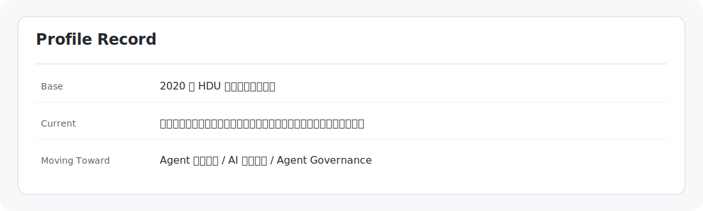
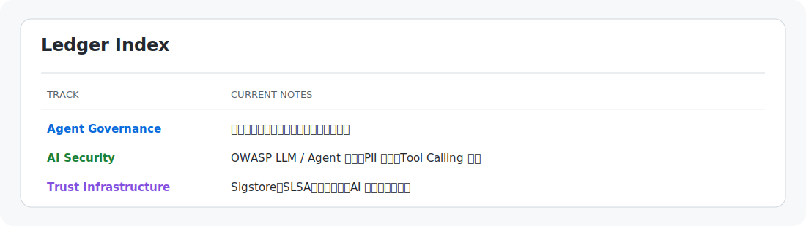
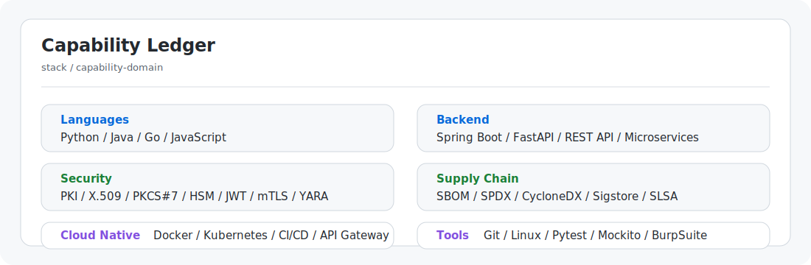
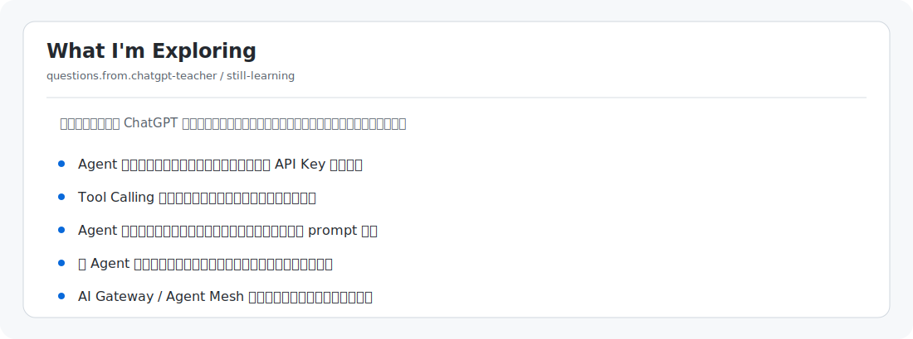

  

  
  
  

> 2020 年信安专业本科毕业，一直在菊厂干到现在，在华子干开发，这辈子也算是有了🤤。没招了，只能闲时借助 Codex 老师、Claude 老师研究点赛博柑水。

之前主要做传统安全工具开发，现在逐步转向 **Agent 应用开发** 与 **AI 安全治理**。

---

  

  

---

## Open Source Ledger

<!-- CONTRIBUTIONS:START -->
| Date | Repository | Stars | Type | Record | Status | Link |
|---|---|---:|---|---|---|---|
| - | Action 尚未运行 | - | - | 等待 GitHub Actions 自动拉取真实 Issue / PR 记录 | - | - |
<!-- CONTRIBUTIONS:END -->

---

  

  

---

## Contact

- GitHub: Miracle778
