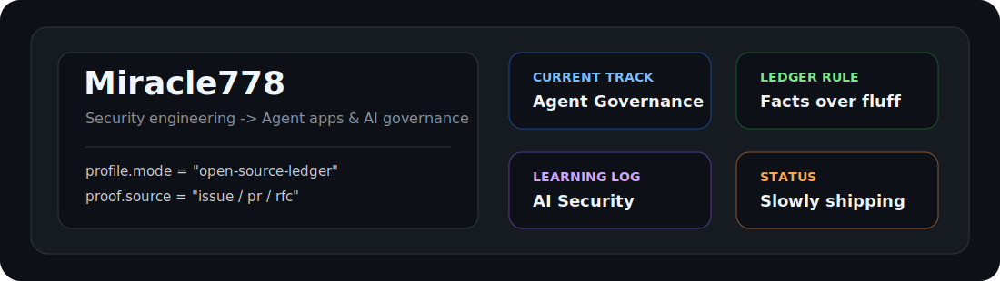

# Hi, I'm Miracle778

  

2020 年信安专业本科毕业，一直在菊厂干到现在，在华子干开发，这辈子也算是有了🤤，没招了，只能闲时借助codex老师、claude老师研究点赛博柑水了...  

之前都是传统安全工具开发，现在逐步转向 **Agent 应用开发** 与 **AI 安全治理**中。

---

## About Me
- 2020 年HDU本科毕业进了华子。
- 日常技术栈主要围绕 Python / Java、Spring Boot、微服务、云原生、CI/CD、安全工具链这些方向。
- 安全侧长期接触 PKI、X.509、HSM、JWT、mTLS、YARA、软件供应链安全等工程化能力。
- 最近对 Sigstore、SLSA、SBOM、AI 资产可信签名、Agent 安全治理这些方向比较感兴趣。
- 最近重点转向 Agent Governance、AI Gateway、Tool Calling 审计、PII 检测、权限边界与 AI 安全治理。

---

## Current Focus

| Direction | What I'm Working On |
|---|---|
| Agent Governance | Agent 身份、权限边界、治理中间件、策略拦截 |
| AI Security | OWASP LLM / Agent 风险、PII 检测、Tool Calling 审计 |
| AI Trust Infrastructure | Sigstore、Vault、透明日志、AI 资产签名与验签 |
| Cloud Native Security | DevSecOps、软件供应链安全、SBOM/OBOM、CVE 分析 |
| Agent Engineering | AI Gateway、Agent Mesh、DevOps Agent、CVE Analysis Agent |

---

## Open Source Activity

这里采用账本风格：不手动编故事，不把脑图包装成项目，只通过 GitHub Actions 拉取真实的 Issue / PR / RFC 参与记录。  
没有就是没有，先认，后补；开源履历这东西，主打一个慢慢攒。

<!-- CONTRIBUTIONS:START -->
| Repository | Stars | Type | Contribution | Status | Link |
|---|---:|---|---|---|---|
| Action 尚未运行 | - | - | 等待 GitHub Actions 自动拉取真实 Issue / PR 记录 | - | - |
<!-- CONTRIBUTIONS:END -->

---

## Tech Stack

平时接触的技术栈放这里，尽量只写能力域，不展开具体历史项目。

| Category | Keywords |
|---|---|
| Languages | Python, Java, Go, JavaScript |
| Backend | Spring Boot, FastAPI, REST API, Microservices |
| Security | PKI, X.509, PKCS#7, HSM, JWT, mTLS, YARA |
| Supply Chain | SBOM, OBOM, SPDX, CycloneDX, Sigstore, SLSA |
| Cloud Native | Docker, Kubernetes, CI/CD, API Gateway, 灰度发布, 限流熔断 |
| Testing & Tools | Git, Linux, Pytest, Mockito, BurpSuite |

---

## What I'm Exploring

下面这些是之前跟 ChatGPT 老师各种讨论，它的记忆给我梳理的一些问题。有些可能是突然一些想法随口跟他讨论的，有些是后续还认真研究、稍微实践了一番的，先记在下面好了😂
- Agent 如何具备可治理的身份，而不是只靠一串 API Key 到处跑。
- Tool Calling 如何做审计、记录、策略控制和权限收敛。
- Agent 框架如何接入外部治理层，避免安全能力只停留在 prompt 里。
- 多 Agent 系统里的权限边界、调用链路和责任边界该怎么表达。
- AI Gateway / Agent Mesh 是否能承载统一的安全治理能力。
- PKI / mTLS / 证书身份 / 透明日志这些传统可信基础设施，如何迁移到 Agent 和 AI 资产场景。
- CVE 分析、补丁分析、补丁验证流程能否由 Agent 辅助完成，并且结果可追溯、可审计。

---

## Contact

- GitHub: Miracle778
