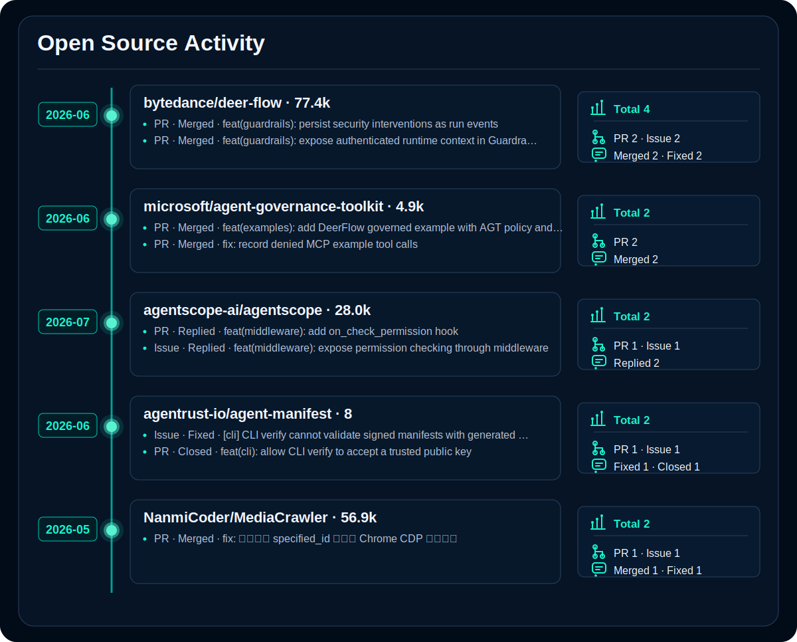

  
  

> 2020 年信安专业本科毕业，一直在菊厂干到现在，在华子干开发，这辈子也算是有了🤤。没招了，只能闲时借助 Codex 老师、Claude 老师研究点赛博柑水。

之前主要做传统安全工具开发，现在逐步转向 **Agent 应用开发** 与 **AI 安全治理**。

---

  
  

  
  

---

<picture>
  <source media="(prefers-color-scheme: dark)" srcset="./assets/open-source-signals-dark.svg">
  <source media="(prefers-color-scheme: light)" srcset="./assets/open-source-signals-light.svg">
  
</picture>

Full contribution log

<!-- CONTRIBUTIONS:START -->
| Date | Repository | Stars | Type | Record | Discuss | Status | Signal |
|---|---|---:|---|---|---:|---|---|
| 2026-06-27 | [bytedance/deer-flow](https://github.com/bytedance/deer-flow) | 75.9k | PR | [feat(guardrails): persist security interventions as run events](https://github.com/bytedance/deer-flow/pull/3837) | 7 | Open | In review |
| 2026-06-27 | [bytedance/deer-flow](https://github.com/bytedance/deer-flow) | 75.9k | Issue | [[feat]: Persist guardrail interventions as run events](https://github.com/bytedance/deer-flow/issues/3836) | 0 | Open | Open |
| 2026-06-21 | [agentrust-io/agent-manifest](https://github.com/agentrust-io/agent-manifest) | 5 | PR | [feat(cli): allow CLI verify to accept a trusted public key](https://github.com/agentrust-io/agent-manifest/pull/183) | 0 | Closed | Closed |
| 2026-06-21 | [agentrust-io/agent-manifest](https://github.com/agentrust-io/agent-manifest) | 5 | Issue | [[cli] CLI verify cannot validate signed manifests with generated public key](https://github.com/agentrust-io/agent-manifest/issues/182) | 0 | Closed | Fixed by PR #188 |
| 2026-06-20 | [bytedance/deer-flow](https://github.com/bytedance/deer-flow) | 75.9k | PR | [feat(guardrails): expose authenticated runtime context in GuardrailRequest](https://github.com/bytedance/deer-flow/pull/3665) | 9 | Merged | Accepted |
| 2026-06-14 | [microsoft/agent-governance-toolkit](https://github.com/microsoft/agent-governance-toolkit) | 4.6k | PR | [feat(examples): add DeerFlow governed example with AGT policy and audit integration](https://github.com/microsoft/agent-governance-toolkit/pull/3020) | 7 | Merged | Accepted |
| 2026-06-02 | [microsoft/agent-governance-toolkit](https://github.com/microsoft/agent-governance-toolkit) | 4.6k | PR | [fix: record denied MCP example tool calls](https://github.com/microsoft/agent-governance-toolkit/pull/2774) | 5 | Merged | Accepted |
| 2026-05-31 | [NanmiCoder/MediaCrawler](https://github.com/NanmiCoder/MediaCrawler) | 55.0k | PR | [fix: 修复知乎 specified_id 和已有 Chrome CDP 连接问题](https://github.com/NanmiCoder/MediaCrawler/pull/909) | 0 | Merged | Accepted |

[View all PRs](https://github.com/pulls?q=author%3AMiracle778) · [View all Issues](https://github.com/issues?q=author%3AMiracle778)
<!-- CONTRIBUTIONS:END -->

---

  
  

  
  

---

## Contact

- GitHub: Miracle778
